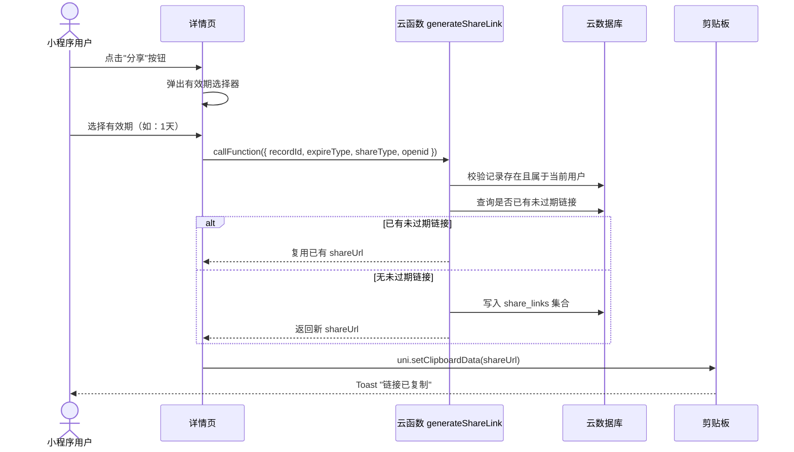
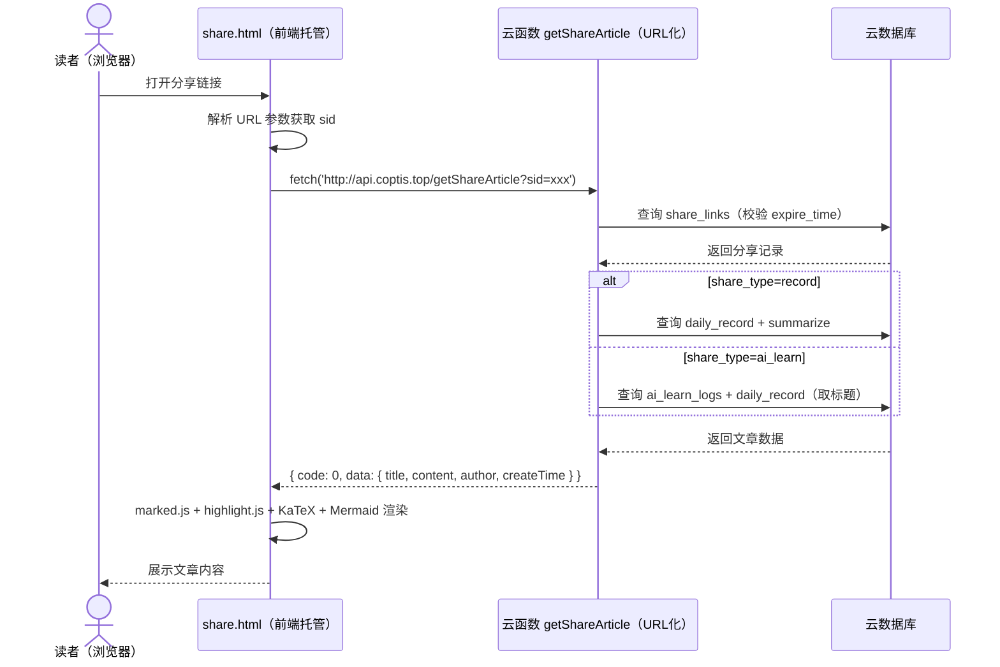

## 需求简述

用户在小程序详情页点击"分享"按钮，系统生成一个可公开访问的 H5 网页链接。任何人通过浏览器打开该链接，即可阅读笔记的 Markdown 内容（含代码高亮、LaTeX 公式、流程图等）。

**核心约束：**
- 基于现有 uniCloud 阿里云基础设施，不额外租服务器、不买域名
- 分享链接无需登录即可访问
- 支持两种分享类型：普通记录和 AI 辅导结果

**涉及模块：**
- 小程序端：详情页 / AI 辅导结果页的分享按钮、链接生成与复制
- 云端：云函数 URL 化（提供文章数据接口）
- H5 页面：uniCloud 前端网页托管（独立 HTML 页面，渲染 Markdown）

## 业务逻辑

### 模块划分

| 模块 | 位置 | 职责 |
|------|------|------|
| 分享按钮（普通记录） | `subpackage/depart/detail.vue` | 用户触发分享，调用云函数获取链接 |
| 分享按钮（AI 辅导） | `subpackage/depart/learn-result-detail.vue` | AI 辅导结果分享 |
| 分享 API | `api/share.js` | 封装云函数调用 |
| 云函数 `generateShareLink` | `uniCloud-aliyun/cloudfunctions/generateShareLink/` | 校验权限，生成或复用分享链接 |
| 云函数 `getShareArticle` | `uniCloud-aliyun/cloudfunctions/getShareArticle/` | URL 化接口，根据 sid 返回文章数据 |
| H5 阅读页 | `docs/article-share/share.html`（部署到前端网页托管） | 接收 sid 参数，调用云函数，渲染 Markdown |

### 核心流程

```mermaid
flowchart TD
    A[用户点击分享按钮] --> B[弹出有效期选择器]
    B --> B1[选择有效期：1小时 / 1天 / 1周 / 1年 / 永久]
    B1 --> C[调用云函数 generateShareLink]
    C --> C1{已有未过期链接?}
    C1 -->|是| E[复用已有链接]
    C1 -->|否| C2[创建新链接]
    C2 --> E
    E --> F[复制到剪贴板]
    F --> G[Toast 提示已复制]

    I[他人打开链接] --> J[H5 页面加载]
    J --> K[从 URL 解析 sid]
    K --> L[调用云函数 getShareArticle]
    L --> M{链接是否有效?}
    M -->|有效且未过期| N[渲染 Markdown 内容]
    M -->|已过期| O[显示"链接已失效"]
    M -->|不存在| P[显示"链接无效"]
```

### 链接格式

```
http://doc.coptis.top/share.html?sid={{shareId}}
```

- `shareId`：`share_links` 集合的 `_id`
- H5 页面通过 URL 参数获取 `sid`，调用云函数验证有效期并返回内容

## 时序图

### 生成分享链接



### 访问分享文章



## 数据结构

### 集合：`share_links`

| 字段 | 类型 | 说明 |
|------|------|------|
| `_id` | string | 自动生成，即 shareId |
| `record_id` | string | 关联 `daily_record` 的 `_id` |
| `share_type` | string | 分享类型：`record`（默认）/ `ai_learn` |
| `log_id` | string | AI 学习结果 ID（share_type 为 ai_learn 时） |
| `expire_time` | number | 过期时间戳（毫秒），永久则为 `null` |
| `create_time` | number | 创建时间戳 |
| `create_by` | string | 创建者 openid |

**索引**：`_id`（默认）、`record_id`、`expire_time`

### 有效期对应关系

| expireType | expire_time 计算 | 说明 |
|------------|-----------------|------|
| `1h` | `create_time + 3600000` | 1 小时 |
| `1d` | `create_time + 86400000` | 1 天 |
| `1w` | `create_time + 604800000` | 1 周 |
| `1y` | `create_time + 31536000000` | 1 年 |
| `forever` | `null` | 永久 |

### 云函数 `generateShareLink` 参数

| 参数 | 类型 | 说明 |
|------|------|------|
| `recordId` | string | 记录 ID |
| `expireType` | string | 有效期：1h / 1d / 1w / 1y / forever |
| `shareType` | string | 分享类型：record（默认）/ ai_learn |
| `logId` | string | AI 学习结果 ID（ai_learn 时必填） |
| `openid` | string | 用户 openid（客户端 Vuex store 传入） |

### 云函数 `getShareArticle` 返回结构

```json
{
  "code": 0,
  "data": {
    "title": "记录标题",
    "content": "Markdown 内容",
    "createTime": "2026-04-16 14:30",
    "author": "作者昵称"
  }
}
```

## 阿里云 URL 化响应格式

阿里云云函数 URL 化不支持 `context.setHeader()`，必须使用**集成响应格式**：

```javascript
{
  mpserverlessComposedResponse: true,
  statusCode: 200,
  headers: {
    'Content-Type': 'application/json',
    'Access-Control-Allow-Origin': '*',
    'Access-Control-Allow-Methods': 'GET, OPTIONS',
    'Access-Control-Allow-Headers': 'Content-Type'
  },
  body: JSON.stringify(data)
}
```

## 身份认证

云函数不使用 `event.UNICLOUD_INFO.OPENID`（不稳定），改为客户端从 Vuex store 获取 openid 显式传入：

```javascript
// api/share.js
const user = store.state.user;
uniCloud.callFunction({
  name: 'generateShareLink',
  data: { recordId, expireType, openid: user.openid }
})
```

## H5 页面渲染技术栈

| 库 | 版本 | 用途 |
|----|------|------|
| marked.js | v12.0.2 | Markdown 解析 |
| highlight.js | v11.11.1 | 代码语法高亮 |
| KaTeX | v0.16.11 | LaTeX 公式渲染 |
| Mermaid | v10.9.3 | 流程图 / 时序图渲染 |

注意：Mermaid 渲染前需确保容器可见（`display` 非 `none`），否则布局计算会失败。

## 链接复用策略

同一用户对同一内容（同 share_type）生成分享链接时，先查询是否已有未过期链接：
- 有 → 直接复用，返回已有 shareUrl
- 无 → 创建新链接

避免重复创建导致数据库膨胀。

## 边界情况

| 场景 | 处理方式 |
|------|---------|
| 用户未登录点击分享 | `withAuth` 拦截，提示未登录 |
| 链接已过期 | 云函数校验 `expire_time < Date.now()`，返回错误 |
| 记录被删除后打开链接 | 云函数查询返回空，显示"文章不存在或已被作者删除" |
| 记录没有总结内容 | H5 页面显示空内容，保留标题和作者信息 |
| AI 辅导结果关联的记录被删除 | 云函数查询 daily_record 标题失败，使用默认标题"AI 辅导内容" |
| 同一内容多次分享 | 复用已有未过期链接，不重复创建 |
| OPTIONS 预检请求 | 云函数返回 `{ code: 0 }`，含 CORS 头 |

## 错误处理

| 错误场景 | 处理方式 |
|---------|---------|
| `generateShareLink` 调用失败 | 小程序端 catch 错误，Toast 提示错误信息 |
| `getShareArticle` 调用失败 | H5 页面显示"加载失败，请检查网络后刷新" |
| `sid` 不存在或格式错误 | 云函数返回 `{ code: -1, message: '链接无效' }` |
| 数据库查询异常 | 云函数 try-catch，返回 `{ code: -1, message: '服务异常' }` |
| H5 页面网络超时 | fetch 10s 超时，显示"网络超时，请刷新重试" |
| Mermaid 渲染失败 | try-catch 包裹，不影响页面其他内容展示 |

## 部署配置

| 配置项 | 值 |
|-------|---|
| 前端网页托管域名 | `doc.coptis.top` |
| 云函数 URL 化域名 | `api.coptis.top` |
| 分享链接格式 | `http://doc.coptis.top/share.html?sid={{shareId}}` |
| API 地址 | `http://api.coptis.top/getShareArticle` |

## 变更记录

| 日期 | 作者 | 变更说明 |
|------|------|---------|
| 2026-04-16 | yuanchuang | 初始版本 |
| 2026-05-04 | yuanchuang | 新增 AI 辅导结果分享、链接复用、CDN 渲染升级、阿里云集成响应格式、客户端 openid 传递，标记完成 |
