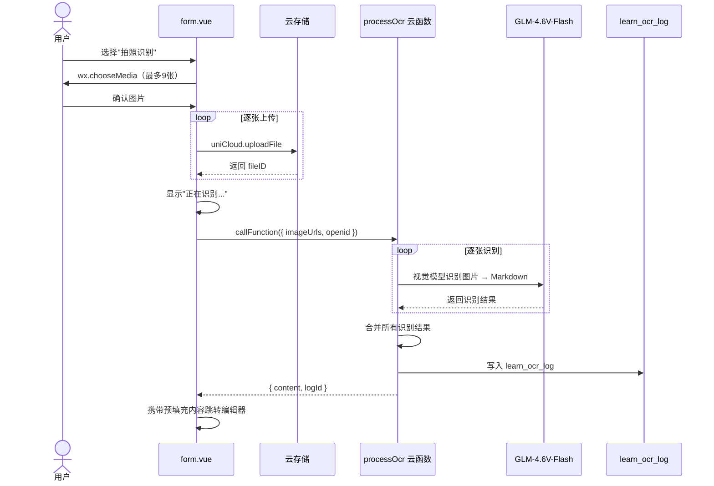
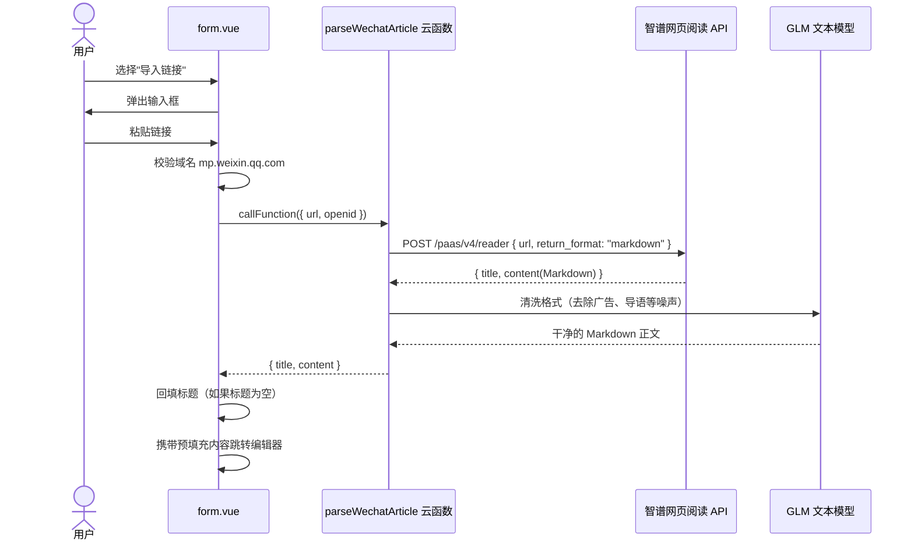
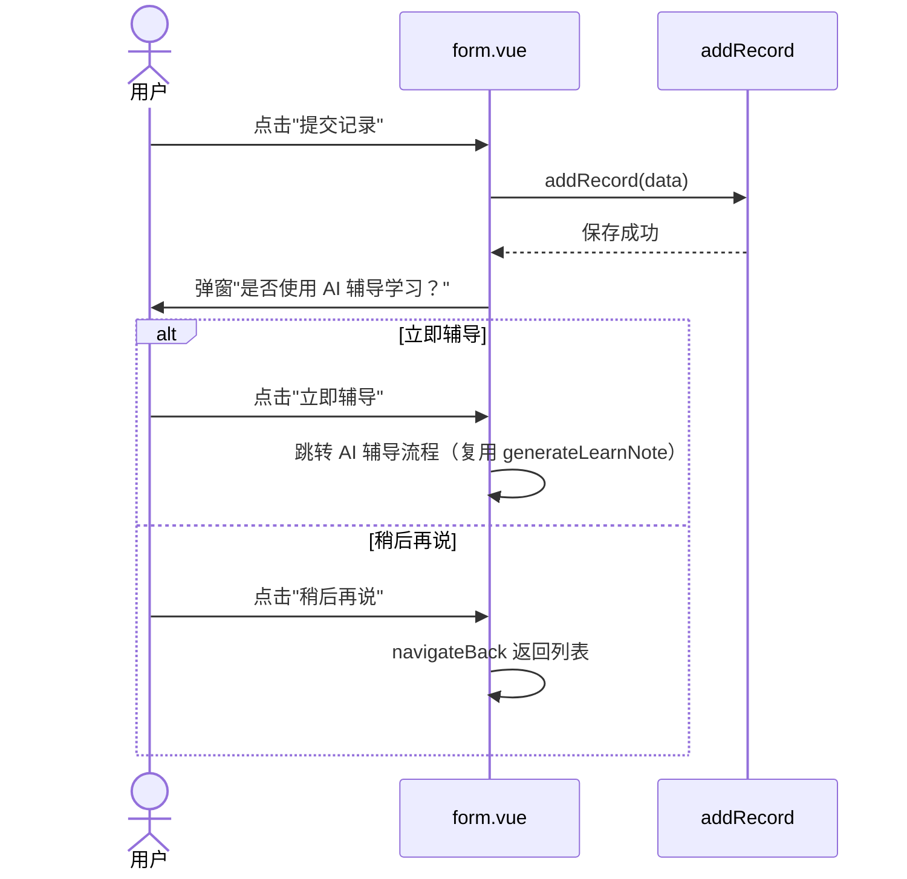

# 文档新增多来源输入 Design

## 需求简述

在现有文档新增流程（`depart/form.vue`）的"添加总结内容"环节，新增 OCR 拍照识别和微信公众号链接导入两种输入方式，与手动输入并列。识别/解析结果预填充到 `summarize/index.vue` 的编辑器中，用户编辑确认后保存。记录提交成功后新增 AI 辅导引导入口。

**修改范围**：`depart/form.vue`（输入方式选择弹窗 + AI 引导）、`summarize/index.vue`（内容预填充）、`store/modules/summarize.js`（传递预填充内容和来源信息）

**新增云函数**：`processOcr`（OCR 识别）、`parseWechatArticle`（链接解析，基于 GLM 网络搜索工具调用）

## 业务逻辑

### 模块划分

| 模块 | 位置 | 职责 |
|------|------|------|
| 输入方式选择弹窗 | `depart/form.vue` | 新增时弹出三种输入方式选择 |
| OCR 识别流程 | `depart/form.vue` → 云函数 | 选图 → 上传 → 调 processOcr → 预填充 |
| 链接导入流程 | `depart/form.vue` → 云函数 | 校验域名 → 调 parseWechatArticle → 预填充 |
| 内容预填充 | `summarize/index.vue` | 接收预填充内容，填入 md-editor |
| AI 辅导引导 | `depart/form.vue` | 提交成功后弹窗引导 |
| OCR 云函数 | `processOcr` | 调 GLM-4.6V-Flash 视觉模型识别图片 |
| 链接解析云函数 | `parseWechatArticle` | 调智谱网页阅读 API（`/paas/v4/reader`）提取文章内容 |
| Summarize Store | `store/modules/summarize.js` | 扩展：传递预填充内容和来源类型 |

### 核心流程

```mermaid
flowchart TD
    A[用户点击"添加总结内容"] --> B{已有总结?}
    B -->|是| C[直接进入编辑器]
    B -->|否| D[弹出输入方式选择]

    D --> E1[手动输入]
    D --> E2[拍照识别]
    D --> E3[导入链接]

    E1 --> F[进入 summarize/index.vue]

    E2 --> G[wx.chooseMedia 选择图片]
    G --> H[上传图片到云存储]
    H --> I[调用 processOcr 云函数]
    I --> J{识别成功?}
    J -->|是| K[写入 learn_ocr_log]
    K --> L[携带内容进入编辑器]
    J -->|否| M[提示错误，可重试]

    E3 --> N[弹出链接输入框]
    N --> O{校验域名 mp.weixin.qq.com?}
    O -->|否| P[提示"暂不支持该链接"]
    O -->|是| Q[调用 parseWechatArticle 云函数]
    Q --> R{解析成功?}
    R -->|是| S[携带内容进入编辑器]
    R -->|否| T[提示错误，可重试]

    F --> U[用户编辑并保存总结]
    L --> U
    S --> U
    U --> V[返回 form.vue，提交记录]
    V --> W[弹出"是否使用 AI 辅导学习？"]
    W --> X1[立即辅导 → AI 流程]
    W --> X2[稍后再说 → 返回列表]
```

## 时序图

### OCR 拍照识别



### 链接导入



### 保存后 AI 引导



## 数据结构

### 新增集合：`learn_ocr_log`（与学习专区共用）

| 字段 | 类型 | 说明 |
|------|------|------|
| `document_id` | string | 关联 learn_document（depart 场景为空） |
| `image_urls` | array\<string\> | 云存储文件路径列表 |
| `raw_results` | array\<string\> | 每张图片的 GLM 原始识别结果 |
| `merged_content` | string | 合并后的 Markdown 内容 |
| `status` | string | `pending` / `processing` / `done` / `failed` |
| `error_msg` | string | 错误信息 |
| `source` | string | 来源标识：`depart`（文档新增）/ `learnZone`（学习专区） |
| `create_time` | number | 创建时间戳 |
| `create_by` | string | 创建人 openid |

### Store 扩展：`summarize.js`

| 新增字段 | 类型 | 说明 |
|----------|------|------|
| `prefillContent` | string | 预填充到编辑器的 Markdown 内容 |
| `prefillSource` | string | 来源：`manual` / `ocr` / `link` |
| `prefillTitle` | string | 链接导入时的文章标题（回填 form.vue） |
| `ocrLogId` | string | OCR 日志 ID（用于关联） |

**新增 action：**

```javascript
// 缓存预填充信息
cachePrefill({ commit }, { content, source, title, ocrLogId })
// 清空预填充信息（编辑器加载后调用）
clearPrefill({ commit })
```

### 云函数入参

**`processOcr`**：

| 参数 | 类型 | 说明 |
|------|------|------|
| `imageUrls` | array\<string\> | 云存储文件路径列表 |
| `source` | string | `depart` |
| `openid` | string | 用户 openid |

**`parseWechatArticle`**：

| 参数 | 类型 | 说明 |
|------|------|------|
| `url` | string | 微信公众号文章链接 |
| `openid` | string | 用户 openid |

### 云函数返回结构

```javascript
// processOcr 返回
{ code: 0, data: { content: "合并后的Markdown", logId: "xxx" } }

// parseWechatArticle 返回
{ code: 0, data: { title: "文章标题", content: "清洗后的Markdown" } }
```

### 数据流转

```
form.vue → store.cachePrefill({ content, source }) → summarize/index.vue
                                                        ↓
                                                   读取 prefillContent 填入编辑器
                                                        ↓
                                                   store.clearPrefill()
```

## 边界情况

| 场景 | 处理方式 |
|------|---------|
| 已有总结内容时点击 | 直接进入编辑器，不弹出输入方式选择 |
| OCR 识别失败 | 提示错误信息，保留在 form.vue，可重新选择输入方式或切换手动输入 |
| 链接域名非白名单 | 提示"暂不支持该链接，目前仅支持微信公众号文章"，不调用云函数 |
| 链接解析失败（文章已删除/网络问题） | 提示错误信息，用户可重试或切换手动输入 |
| 编辑器已有内容时预填充 | 追加内容而非覆盖（用分隔符隔开），避免丢失已有内容 |
| 标题自动回填 | 仅当 form.vue 标题为空时回填，已有标题不覆盖 |
| 单张图片识别为空 | 合并时跳过空结果，最终内容为空则提示"未能识别内容"并引导手动输入 |
| 图片上传失败 | 提示"图片上传失败"，不继续调用 OCR，用户可重试 |
| AI 辅导引导 | 不强制，用户选"稍后再说"正常返回列表，不影响记录保存 |
| 游客模式 | OCR 和链接导入均需登录，通过 `withAuth` 拦截 |
| 图片数量为 0 | 用户取消选图时不触发任何操作，回到 form.vue |

## 错误处理

| 错误场景 | 处理方式 |
|---------|---------|
| `wx.chooseMedia` 失败 | 用户取消时不做处理；权限拒绝提示"请在设置中开启相机权限" |
| 图片上传云存储失败 | 停止后续上传，提示"图片上传失败，请重试"，已上传的图片不删除（下次重试时复用） |
| `processOcr` 云函数调用失败 | catch 错误，Toast 提示"识别失败，请重试或选择手动输入" |
| OCR 客户端超时（90s） | 提示"识别超时，请减少图片数量或稍后重试" |
| GLM 视觉模型返回空/异常 | 云函数内部检查返回内容，为空则标记 `status: failed`，返回错误码 |
| `parseWechatArticle` 云函数调用失败 | catch 错误，Toast 提示"链接解析失败，请重试或选择手动输入" |
| 链接解析客户端超时（60s） | 提示"解析超时，请稍后重试" |
| 智谱网页阅读 API 超时/失败 | 云函数设置 30s 超时，失败返回 `{ code: -1, message: "文章获取失败" }` |
| GLM 清洗失败 | 跳过清洗步骤，直接返回网页阅读 API 的原始内容 |
| `learn_ocr_log` 写入失败 | 不影响主流程，云函数内部 try-catch，OCR 日志写入失败仍返回识别内容 |
| AI 辅导引导点击后跳转失败 | `callGenerateLearnNote` 失败时 Toast 提示，不影响记录已保存的事实 |

### 云函数统一错误格式

```javascript
{ code: -1, message: "具体错误描述" }
```

### 客户端错误处理模式

```javascript
// form.vue 中统一模式（带超时保护）
function withTimeout(promise, ms, message) {
  return Promise.race([
    promise,
    new Promise((_, reject) => setTimeout(() => reject(new Error(message)), ms))
  ])
}

// OCR 流程示例
try {
  // 阶段1：逐张上传，展示上传进度
  for (let i = 0; i < tempFiles.length; i++) {
    uni.showLoading({ title: `正在上传第 ${i + 1}/${total} 张...`, mask: true })
    await uniCloud.uploadFile(...)
  }
  // 阶段2：识别，展示预估时间
  uni.showLoading({ title: `正在识别 ${total} 张图片（预计约${total * 4}s）`, mask: true })
  await withTimeout(
    callProcessOcr({ imageUrls, source: 'depart' }),
    90000,
    '识别超时，请减少图片数量或稍后重试'
  )
  // 成功 → 预填充跳转
} catch (err) {
  uni.showToast({ title: err.message || '识别失败，请重试', icon: 'none' })
} finally {
  uni.hideLoading()
}

// 链接导入流程示例
try {
  uni.showLoading({ title: '正在解析文章（预计约15s）', mask: true })
  await withTimeout(
    callParseWechatArticle({ url }),
    60000,
    '解析超时，请稍后重试'
  )
} catch (err) {
  uni.showToast({ title: err.message || '解析失败，请重试', icon: 'none' })
} finally {
  uni.hideLoading()
}
```

## 变更记录

| 日期 | 作者 | 变更内容 |
|------|------|---------|
| 2026-05-06 | yuanchuang | 初始版本 |
| 2026-05-07 | yuanchuang | 更新客户端错误处理模式：增加 withTimeout 超时保护、分阶段 loading 进度展示 |
