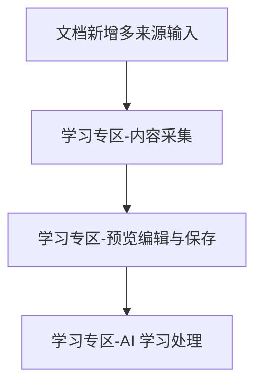

# 学习专区 Spec

## 背景

当前 Toolbox 的 AI 辅导功能仅支持用户在小程序内手打 Markdown 笔记作为输入，存在以下痛点：

1. **笔记数字化门槛高**：大量学生的笔记是手写的，缺乏 OCR 能力导致他们无法将纸质笔记转化为可处理的内容
2. **内容来源单一**：用户只能依赖已有的记录总结，无法从外部资料（课本截图、试卷拍照、公众号文章）获取学习内容
3. **AI 辅导依附于记录模块**：现有 AI 辅导是记录详情页的一个附属功能，无法独立扩展，限制了 AI 能力的发挥空间
4. **缺乏专业学习入口**：用户需要一个专门的学习辅助场景，而非在记录管理中穿插使用 AI 功能

基于以上痛点，决定从两个层面解决：

1. **能力下沉**：将多来源输入（OCR 拍照、链接导入）集成到现有的文档新增流程中，让所有用户在任何场景下都能使用
2. **专区独立**：新增独立的学习专区模块，提供完整的**多来源内容采集 → 预览编辑 → 用户选择处理模式（保存或 AI 处理） → AI 智能处理**工作流

## 整体目标

1. 增强现有文档新增流程，支持 OCR 拍照识别和微信公众号链接导入，降低内容输入门槛
2. 建立独立的学习专区模块，作为 Toolbox 的核心学习场景入口，提供归纳复习等 AI 智能处理能力
3. v1 跑通最小可用闭环：多来源输入 → 预览编辑 → 保存/AI 处理

## 子需求拆分

### 拆分说明

按两条业务线拆分为四个子需求：

- **能力层**（multi-source-input）：增强现有文档新增流程，将 OCR 和链接导入能力下沉到 depart 模块，所有场景通用
- **学习专区层**（content-source + document-workflow + ai-learning）：独立的学习专区模块，提供完整工作流

### 子需求列表

| 子需求 | 目录 | 简要说明 | 依赖 |
|--------|------|---------|------|
| 文档新增多来源输入 | `multi-source-input/` | 在现有 depart 新增流程中集成 OCR 拍照和链接导入能力 | 无 |
| 内容采集 | `content-source/` | 学习专区内容采集（已有笔记选择 + 复用多来源输入能力） | multi-source-input |
| 预览编辑与保存 | `document-workflow/` | 文档预览、Markdown 编辑、保存到学习专区 | 无 |
| AI 学习处理 | `ai-learning/` | 归纳复习（精选笔记 + 练习题），异步处理架构 | 无 |

> 注：`multi-source-input` 是基础能力，`content-source` 在学习专区场景下复用该能力。

### 依赖关系



## 工作流概览

### 业务线一：现有文档新增流程（增强）

```
用户新增记录
       │
       ▼
  ┌─────────────────────────────────────┐
  │  选择内容输入方式                      │
  │  ├── 手动输入（现有能力，保留）         │
  │  ├── OCR 拍照识别（新增）              │
  │  └── 微信公众号链接导入（新增）         │
  └─────────────┬───────────────────────┘
                ▼
  ┌─────────────────────────────────────┐
  │  预览编辑（复用 md-editor）           │
  │  └── 用户确认内容                     │
  └─────────────┬───────────────────────┘
                ▼
  ┌─────────────────────────────────────┐
  │  保存总结（现有流程）                   │
  │  └── 保存后提供 AI 处理选项            │
  └─────────────────────────────────────┘
```

### 业务线二：学习专区完整工作流

```
用户进入学习专区
       │
       ▼
  ┌─────────────────────────────────────┐
  │  第一步：内容采集                      │
  │  ├── 从已有笔记选择（引用 record）       │
  │  ├── OCR 批量拍照（复用多来源输入能力）   │
  │  └── 微信公众号链接（复用多来源输入能力） │
  └─────────────┬───────────────────────┘
                ▼
  ┌─────────────────────────────────────┐
  │  第二步：预览编辑                      │
  │  ├── 展示解析/识别后的 Markdown 内容    │
  │  ├── 用户编辑修改（复用 md-editor）     │
  │  └── 用户确认内容                      │
  └─────────────┬───────────────────────┘
                ▼
  ┌─────────────────────────────────────┐
  │  第三步：用户选择处理模式               │
  │  ├── 保存文档到学习专区                 │
  │  └── AI 智能处理（v1：归纳复习）        │
  │       ├── 生成精选笔记                  │
  │       └── 生成针对性练习题              │
  └─────────────────────────────────────┘
```

## 与现有模块的关系

| 维度 | 关系 |
|------|------|
| 多来源输入 | OCR 和链接导入能力集成到现有 depart 模块的新增流程中，作为基础能力被所有场景复用 |
| 数据层 | 学习专区独立使用 `learn_document`、`learn_ocr_log`、`learn_ai_result` 集合，不写入 `daily_record` 或 `ai_learn_logs` |
| 内容引用 | 学习专区选择"已有笔记"时，只存储 `source_ref`（recordId），不复制内容 |
| 组件复用 | 预览编辑页复用 `md-editor` 组件，列表页复用 `record-card` 样式 |
| 架构复用 | AI 异步处理复用现有的定时触发器 + 任务队列模式 |
| GLM 复用 | OCR 使用 GLM-4.6V 视觉模型，AI 处理使用 GLM 文本模型，无需新增供应商 |
| AI 处理入口 | 保存总结后提供 AI 处理选项，学习专区详情页也可触发 AI 处理 |

## 整体验收标准

- [ ] 现有文档新增流程支持 OCR 拍照识别和公众号链接导入
- [ ] 保存总结后提供 AI 处理选项
- [ ] 首页存在"学习专区"入口，点击可进入专区列表页
- [ ] 学习专区三种内容来源（笔记选择、OCR 拍照、公众号链接）均可用
- [ ] OCR 批量拍照支持 1-9 张图片，识别结果以 Markdown 展示
- [ ] 预览编辑页可查看和修改文档内容
- [ ] 文档可保存到学习专区列表
- [ ] 归纳复习功能可正常提交并返回精选笔记和练习题
- [ ] 所有写操作需要登录，游客模式下引导登录
- [ ] 学习专区数据与现有记录模块数据完全隔离

## 关联信息

- 需求来源：用户反馈 + 产品规划
- 依赖：GLM-4.6V 视觉模型 API、微信公众号文章解析能力
- 代码地图：[codemap.md](../codemap.md)（已更新学习专区规划章节）
- 规范参考：[ai-product-principles.md](../../.claude/rules/ai-product-principles.md)

## 变更记录

| 日期 | 作者 | 变更内容 |
|------|------|---------|
| 2026-05-06 | yuanchuang | 初始版本 |
| 2026-05-06 | yuanchuang | 新增"文档新增多来源输入"子需求，将 OCR 和链接导入能力下沉到 depart 模块，更新工作流为双业务线架构 |
