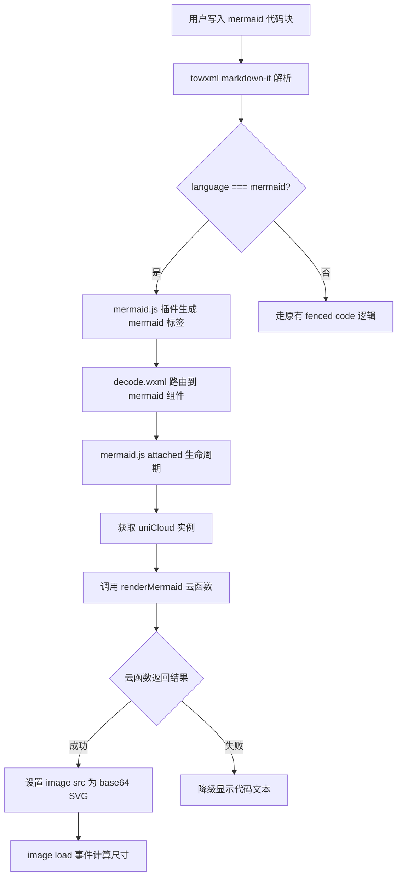
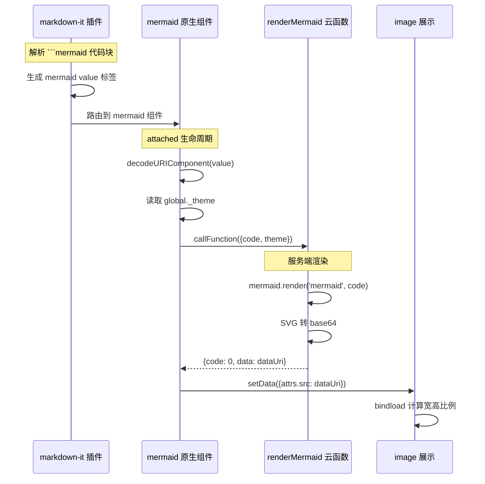

## 需求简述

为 towxml 渲染引擎新增 Mermaid 图表能力。用户在 Markdown 笔记中写入 ` ```mermaid ` 代码块后，小程序端自动调用云函数渲染为 SVG 图片展示。

**核心约束：**
- 完全复用现有 LaTeX 云函数渲染架构（markdown-it 插件 → 原生组件 → 云函数渲染 → base64 image）
- 不改变现有 LaTeX/YUML/ECharts 渲染链路
- 云函数使用 `@mermaid-js/mermaid` npm 包服务端渲染

**涉及模块：**
- 云函数层：`renderMermaid`（新增）
- Markdown 插件层：`wxcomponents/towxml/parse/markdown/plugins/mermaid.js`（新增）
- 原生组件层：`wxcomponents/towxml/mermaid/`（新增 4 个文件）
- 注册层：`decode.wxml`、`decode.json`、`markdown/index.js`（修改 3 个文件）

## 业务逻辑

### 模块划分

| 模块 | 文件 | 职责 |
|------|------|------|
| 云函数 | `uniCloud-aliyun/cloudfunctions/renderMermaid/index.js` | 接收 mermaid 代码 → 渲染 SVG → 返回 base64 |
| Markdown 插件 | `wxcomponents/towxml/parse/markdown/plugins/mermaid.js` | 解析 ` ```mermaid ` 代码块 → 生成 `<mermaid>` 标签 |
| 原生组件 | `wxcomponents/towxml/mermaid/mermaid.js/wxml/json/wxss` | attached 时调云函数 → image 展示 |
| 路由注册 | `decode.wxml` + `decode.json` + `markdown/index.js` | 组件和插件注册 |

### 核心流程



### 时序图



## 错误处理

### 云函数层面

| 场景 | 处理方式 |
|------|---------|
| `code` 参数为空 | 返回 `{code: 400, message: 'code 参数不能为空'}` |
| mermaid 语法错误 | catch 错误，返回 `{code: 500, message: 'Mermaid 语法错误: ...'}` |
| 渲染超时（30s） | `Promise.race` 超时保护，返回 `{code: 500, message: 'Mermaid 渲染超时'}` |
| SVG 为空 | 返回 `{code: 500, message: 'Mermaid 渲染失败：未生成 SVG'}` |
| 其他未知异常 | catch 全局异常，返回 `{code: 500, message: error.message}` |

### 原生组件层面

| 场景 | 处理方式 |
|------|---------|
| `uniCloud` 未定义 | `console.error` 提示，组件静默失败不阻塞页面 |
| 云函数返回 `code !== 0` | `console.error` 打印错误信息，组件静默失败 |
| 云函数调用网络异常 | `catch` 捕获并 `console.error`，组件静默失败 |
| image load 失败 | 保持默认尺寸，不影响布局 |

**降级策略：** 所有失败场景下，mermaid 组件不显示内容（白块），不影响其他 markdown 内容渲染。未来可优化为降级显示原始代码文本。

## 性能设计

### 云函数冷启动

`@mermaid-js/mermaid` 包体积约 2MB，首次冷启动预计 1-2 秒。与现有 `renderLatex`（mathjax-node）体验一致，用户已接受此延迟。

**优化措施：**
- 云函数复用机制：阿里云云函数实例复用期间（约 5 分钟），后续调用 < 500ms
- 编辑器组件中已有 latex/echarts 延迟等待机制（3 秒），mermaid 复用同一逻辑

### SVG 尺寸计算

Mermaid 生成的 SVG 尺寸不固定（flowchart 宽，sequence diagram 高）。设计采用**等比缩放**策略：

```javascript
// image load 回调中计算
load: function(e) {
  const scale = 1.5; // 缩放系数
  const maxWidth = 690; // rpx，扣除页面 padding
  let w = e.detail.width;
  let h = e.detail.height;

  // 宽度限制
  if (w > maxWidth) {
    h = h * maxWidth / w;
    w = maxWidth;
  }

  this.setData({
    size: { w: w / scale, h: h / scale }
  });
}
```

与 latex 组件的区别：latex 使用 `em` 单位（公式内联），mermaid 使用 `rpx` 单位（图表块级）。

### 编辑器延迟处理

在 `component/md-editor/index.vue` 中，已有对 latex/yuml/echarts 的 3 秒额外延迟等待。mermaid 需要加入同一检测条件：

```javascript
// 现有逻辑（约第 126 行）
const hasLatexOrYumlOrEcharts = this.textareaData.includes('$') ||
                                this.textareaData.includes('```yuml') ||
                                this.textareaData.includes('```echarts') ||
                                this.textareaData.includes('```mermaid');  // 新增

if (hasLatexOrYumlOrEcharts) {
  setTimeout(() => { this.loading = false; }, 3000);
}
```

### 编辑器工具栏集成

**更多面板新增 mermaid 按钮**（`component/md-editor/index.vue` 第 53 行附近）：

```xml
<!-- 在 echarts 按钮后新增 -->
<view class="more-item" @click="onMoreAction('mermaid')">
  <view class="iconfont icon-diagram more-icon" />
  <text class="more-label">流程图</text>
</view>
```

> 注：iconfont 中需确认是否有 `icon-diagram`，若无可复用 `icon-flow` 或使用 cuIcon 的 `cuIcon-creativefill`。

**toolbar-actions.js 新增 mermaid 示例模板**（`component/md-editor/toolbar-actions.js`）：

```javascript
mermaid(ctx, appendText) {
  uni.showActionSheet({
    itemList: ['流程图', '时序图', '甘特图', '类图'],
    success: (res) => {
      const templates = [
        // 流程图
        '\n```mermaid\ngraph LR\n    A[开始] --> B{条件判断}\n    B -->|是| C[执行操作]\n    B -->|否| D[结束]\n    C --> D\n```\n',
        // 时序图
        '\n```mermaid\nsequenceDiagram\n    participant A as 用户\n    participant B as 系统\n    A->>B: 发起请求\n    B-->>A: 返回结果\n```\n',
        // 甘特图
        '\n```mermaid\ngantt\n    title 项目计划\n    dateFormat YYYY-MM-DD\n    section 阶段一\n    任务A :a1, 2024-01-01, 7d\n    任务B :after a1, 5d\n```\n',
        // 类图
        '\n```mermaid\nclassDiagram\n    class Animal {\n        +String name\n        +makeSound()\n    }\n    class Dog {\n        +fetch()\n    }\n    Animal <|-- Dog\n```\n',
      ];
      appendText(templates[res.tapIndex]);
    },
  });
},
```
```

## 技术实现

### 云函数 renderMermaid

复用 `renderLatex` 的结构，替换渲染引擎：

```javascript
// uniCloud-aliyun/cloudfunctions/renderMermaid/index.js
'use strict'
const { JSDOM } = require('jsdom')
const mermaid = require('mermaid')

exports.main = async (event, context) => {
  const { code, theme = 'light' } = event

  // 参数校验
  if (!code || typeof code !== 'string') {
    return { code: 400, message: 'code 参数不能为空', data: null }
  }

  // 30 秒超时保护
  const result = await Promise.race([
    renderMermaidSvg(code, theme),
    new Promise((_, reject) => setTimeout(() => reject(new Error('渲染超时')), 30000))
  ])

  return result
}

async function renderMermaidSvg(code, theme) {
  try {
    // mermaid 依赖 DOM，需要 jsdom 模拟
    const dom = new JSDOM('<!DOCTYPE html><body><div id="mermaid"></div></body>')
    global.window = dom.window
    global.document = dom.window.document
    global.navigator = dom.window.navigator

    mermaid.initialize({
      startOnLoad: false,
      theme: theme === 'dark' ? 'dark' : 'default'
    })

    const { svg } = await mermaid.render('mermaid-svg', code)

    // base64 编码
    const base64 = Buffer.from(svg).toString('base64')
    const dataUri = `data:image/svg+xml;base64,${base64}`

    return { code: 0, message: 'success', data: dataUri }
  } catch (err) {
    return { code: 500, message: `Mermaid 渲染失败: ${err.message}`, data: null }
  }
}
```

**package.json 依赖：**
```json
{
  "name": "renderMermaid",
  "version": "1.0.0",
  "main": "index.js",
  "dependencies": {
    "mermaid": "^10.9.3",
    "jsdom": "^24.0.0"
  }
}
```

### markdown-it 插件（mermaid.js）

参照 `plugins/latex.js` 的 fenced code 处理方式：

```javascript
// wxcomponents/towxml/parse/markdown/plugins/mermaid.js
module.exports = md => {
  // 保存原始 fence renderer
  const defaultFence = md.renderer.rules.fence || function(tokens, idx, options, env, self) {
    return self.renderToken(tokens, idx, options)
  }

  md.renderer.rules.fence = function(tokens, idx, options, env, self) {
    const token = tokens[idx]
    const info = token.info.trim()

    if (info === 'mermaid') {
      const encodedCode = encodeURIComponent(token.content).replace(/'/g, '%27')
      return `<mermaid value="${encodedCode}" type="block"></mermaid>`
    }

    // 其他语言走默认渲染
    return defaultFence(tokens, idx, options, env, self)
  }
}
```

### 原生组件 mermaid

完全复用 `latex/latex.js` 结构：

```javascript
// wxcomponents/towxml/mermaid/mermaid.js
Component({
  options: { styleIsolation: 'shared' },
  properties: {
    data: { type: Object, value: {} }
  },
  data: {
    attrs: { src: '', class: '' },
    size: { w: 0, h: 0 }
  },
  lifetimes: {
    attached() {
      const dataAttr = this.data.data.attrs
      const theme = global._theme || 'light'
      const codeValue = decodeURIComponent(dataAttr.value)

      // 获取 uniCloud（三种策略，与 latex 组件一致）
      let cloud = null
      if (typeof uniCloud !== 'undefined') cloud = uniCloud
      else if (typeof global !== 'undefined' && global.uniCloud) cloud = global.uniCloud
      else if (typeof getApp !== 'undefined') cloud = getApp()?.globalData?.uniCloud

      if (!cloud) return

      cloud.callFunction({
        name: 'renderMermaid',
        data: { code: codeValue, theme }
      }).then(res => {
        if (res.result && res.result.code === 0) {
          this.setData({
            attrs: {
              src: res.result.data,
              class: dataAttr.class
            }
          })
        }
      }).catch(err => {
        console.error('Mermaid 渲染失败：', err)
      })
    }
  },
  methods: {
    load(e) {
      const scale = 1.5
      const maxWidth = 690
      let w = e.detail.width
      let h = e.detail.height
      if (w > maxWidth) {
        h = h * maxWidth / w
        w = maxWidth
      }
      this.setData({ size: { w: w / scale, h: h / scale } })
    }
  }
})
```

**mermaid.wxml：**
```xml
<image class="{{attrs.class}}" lazy-load="true" src="{{attrs.src}}"
       style="width:{{size.w}}px; height:{{size.h}}px;" bindload="load">
</image>
```

**mermaid.json：**
```json
{ "component": true, "usingComponents": {} }
```

### 组件注册与路由

**decode.json** — 新增 mermaid 组件注册：
```json
"mermaid": "/wxcomponents/towxml/mermaid/mermaid"
```

**decode.wxml** — 新增 mermaid 标签路由（参照 latex 行）：
```xml
<block wx:if="{{item.tag==='mermaid'}}"><mermaid data="{{item}}" data-data="{{item}}" catch:tap="_tap"/></block>
```

**markdown/index.js 第 56 行** — 注册 mermaid 插件：
```javascript
md.use(require('./plugins/mermaid'))
```

## API 层扩展

在 `api/render.js` 中新增 `renderMermaid` 函数，与 `renderLatex` 结构一致：

```javascript
/**
 * 渲染 Mermaid 图表
 * @param {string} code - Mermaid 代码
 * @param {string} theme - 主题：'light' 或 'dark'
 * @returns {Promise} 返回 Base64 格式的 SVG 图片
 */
function renderMermaid(code, theme = 'light') {
  return new Promise((resolve, reject) => {
    if (typeof uniCloud === 'undefined') {
      reject(new Error('uniCloud 未定义'))
      return
    }
    uniCloud.callFunction({
      name: 'renderMermaid',
      data: { code, theme }
    }).then(res => {
      if (res.result && res.result.code === 0) {
        resolve(res.result.data)
      } else {
        reject(new Error(res.result?.message || 'Mermaid 渲染失败'))
      }
    }).catch(err => {
      console.error('调用 Mermaid 云函数失败：', err)
      reject(err)
    })
  })
}
```

同时在 export 列表中新增 `renderMermaid`。

## 文件变更清单

| 操作 | 文件路径 | 说明 |
|------|---------|------|
| 新增 | `uniCloud-aliyun/cloudfunctions/renderMermaid/index.js` | 云函数主逻辑（mermaid + jsdom） |
| 新增 | `uniCloud-aliyun/cloudfunctions/renderMermaid/package.json` | 依赖声明 |
| 新增 | `uniCloud-aliyun/cloudfunctions/renderMermaid/renderMermaid.param.json` | 测试参数 `{code: "graph LR\nA-->B", theme: "light"}` |
| 新增 | `wxcomponents/towxml/parse/markdown/plugins/mermaid.js` | markdown-it fence 拦截插件 |
| 新增 | `wxcomponents/towxml/mermaid/mermaid.js` | 原生组件逻辑 |
| 新增 | `wxcomponents/towxml/mermaid/mermaid.wxml` | 原生组件模板 |
| 新增 | `wxcomponents/towxml/mermaid/mermaid.json` | 原生组件声明 |
| 新增 | `wxcomponents/towxml/mermaid/mermaid.wxss` | 原生组件样式（空文件） |
| 修改 | `wxcomponents/towxml/decode.wxml` | 新增 mermaid 标签路由块 |
| 修改 | `wxcomponents/towxml/decode.json` | 新增 mermaid 组件注册 |
| 修改 | `wxcomponents/towxml/parse/markdown/index.js` | 新增 `md.use(require('./plugins/mermaid'))` |
| 修改 | `api/render.js` | 新增 `renderMermaid` 函数 |
| 修改 | `component/md-editor/index.vue` | 新增 mermaid 延迟等待检测 + 更多面板按钮 |
| 修改 | `component/md-editor/toolbar-actions.js` | 新增 mermaid 操作（4 种图表模板） |

## 变更记录

| 日期 | 作者 | 变更 |
|------|------|------|
| 2026-05-25 | yuanchuang | 初稿 |
| 2026-05-25 | yuanchuang | 补充编辑器工具栏集成（更多面板按钮 + mermaid 示例模板） |
