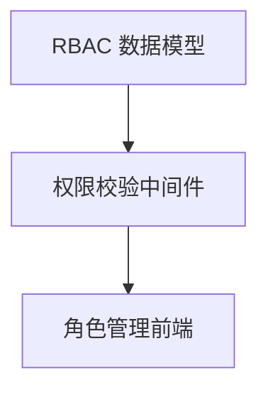
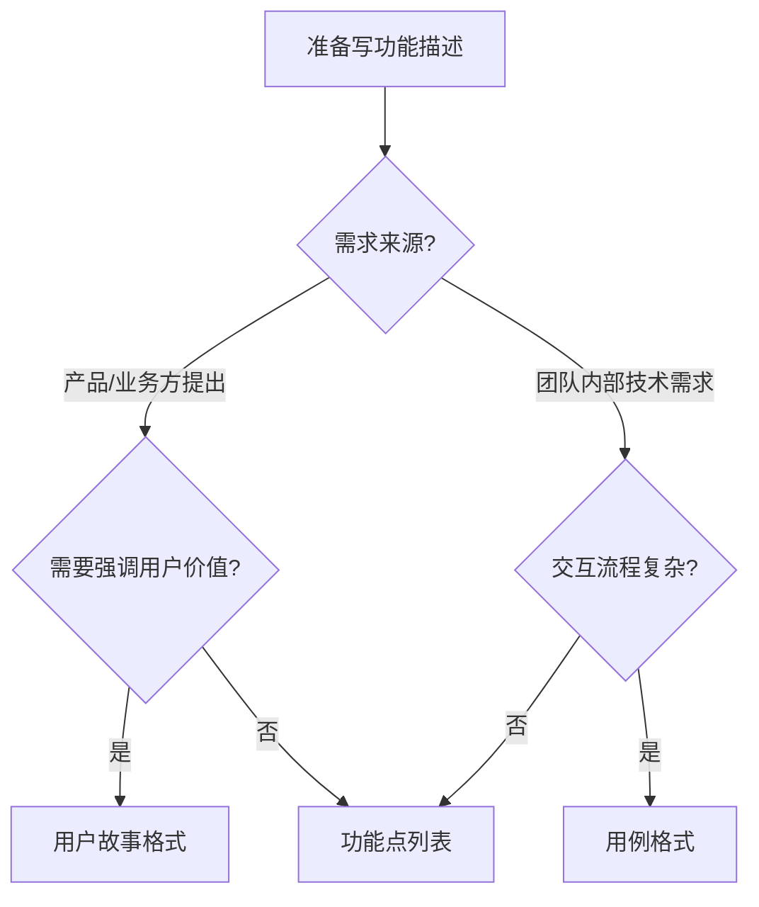
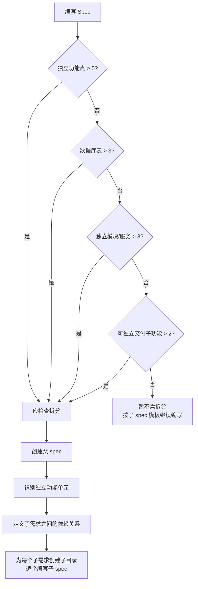
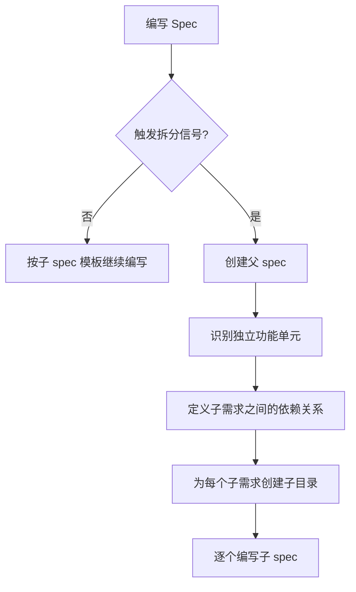

# Spec 书写规范

> 本规范定义了 Spec（需求和验收说明）的书写标准，是团队协作指南 [claude_new.md](../claude_new.md) 的补充文档。

## 1. 概述

### 1.1 目的

- 为团队提供统一的 spec 书写模板，确保格式和质量一致
- 提供面向 AI 可判断的拆分标准，支持大需求自动拆分
- 建立变更管理机制，支持 spec 的生命周期管理

### 1.2 适用范围

所有需要走完整文档流程的中等和复杂任务（详见 [复杂度分级](../claude_new.md#34-任务复杂度分级与文档要求对照表)）。

### 1.3 两种模板

| 模板 | 用途 | 触发条件 |
|------|------|---------|
| **子 spec** | 描述一个可独立交付的功能单元 | 常规功能开发 |
| **父 spec** | 关联和管理拆分后的多个子 spec | 触发拆分信号的大需求 |

### 1.4 功能描述三种格式

根据场景选择：

| 格式 | 适用场景 |
|------|---------|
| 功能点列表 | 需求明确、功能点独立、团队内部快速对齐 |
| 用户故事 | 需求来源于产品/业务方，需要强调用户价值 |
| 用例 | 交互流程复杂，需要精确描述操作路径 |

详见 [第 4 节](#4-功能描述格式选择指引)。

---

## 2. 子 spec 模板

适用于描述一个可独立交付的功能单元。

### 2.1 模板结构

```yaml
---
title: [功能名称]
parent: [父 spec 路径，无父级则留空]
status: draft | reviewing | approved | deprecated
created: YYYY-MM-DD
updated: YYYY-MM-DD
author: [自动读取 git config user.name]
---
```

```markdown
# [功能名称] Spec

## 背景
为什么要做这个功能？业务上下文和动机。
（如果有父 spec，简要说明并引用：详见 [父 spec](../spec.md)）

## 目标
做完之后达到什么效果？用 1-3 句话说清楚。

## 功能描述

（根据场景选择以下任一格式，或混合使用）

### 格式一：功能点列表
适用场景：需求明确、功能点独立、团队内部快速对齐

- 功能点 1
- 功能点 2

### 格式二：用户故事
适用场景：需求来源于产品/业务方，需要强调用户价值

- 作为 [角色]，我希望 [做什么]，以便 [达到什么目的]

### 格式三：用例
适用场景：交互流程复杂，需要精确描述操作路径

- 用例名称：
- 前置条件：
- 操作步骤：1. ... 2. ... 3. ...
- 预期结果：

## 边界条件
- 不做什么（明确排除的范围）
- 限制条件（技术限制、业务限制）

## 验收标准
- [ ] 验收条件 1
- [ ] 验收条件 2
- [ ] 性能要求（如有）：如"接口响应 < 500ms"
- [ ] 扩展性要求（如有）：如"未来需支持多租户"

## 关联信息
- 需求来源：[JIRA-1234 / 产品文档链接]
- 依赖：[依赖的其他 spec 或系统]
- 关联 spec：[相关的兄弟 spec]

## 变更记录
| 日期 | 作者 | 变更内容 |
|------|------|---------|
| YYYY-MM-DD | xxx | 初始版本 |
```

### 2.2 完整示例：导出 Excel 功能

以下是一个完整的"导出 Excel"子 spec 示例：

```yaml
---
title: 用户列表导出 Excel
parent: 
status: approved
created: 2026-03-31
updated: 2026-03-31
author: zhangsan
---
```

```markdown
# 用户列表导出 Excel Spec

## 背景
运营团队每月需要导出用户列表进行数据分析。目前系统只支持页面端分页浏览，无法满足批量数据导出需求。产品提出需要支持导出完整用户列表为 Excel 文件。

## 目标
提供稳定的用户列表导出功能，支持按筛选条件导出，文件格式为 .xlsx，单次导出支持 10 万条数据，响应时间不超过 30 秒。

## 功能描述

### 格式一：功能点列表
适用场景：团队内部快速对齐，功能点独立

- 支持按注册时间范围筛选（默认近 30 天）
- 支持按用户状态筛选（全部 / 正常 / 禁用）
- 导出字段：用户名、邮箱、手机号、注册时间、最后登录时间、状态
- 导出文件格式为 .xlsx，文件名包含导出时间戳
- 单次导出上限 10 万条，超出提示分段导出
- 导出请求支持异步模式，前端可查询导出进度

### 格式二：用户故事（等效表达，可二选一）
适用场景：产品/业务方提出，强调用户价值

- 作为运营人员，我希望导出指定时间范围内的用户列表为 Excel，以便进行数据分析和报表制作
- 作为系统管理员，我希望导出用户列表时不影响其他用户正常使用，以便维护系统的稳定性

### 格式三：用例（等效表达，可二选一）
适用场景：交互流程复杂，需精确描述操作路径

- 用例名称：导出用户列表
- 前置条件：用户已登录，具备导出权限
- 操作步骤：
  1. 用户进入用户管理页面
  2. 设置筛选条件（时间范围、用户状态）
  3. 点击"导出 Excel"按钮
  4. 系统弹出导出进度提示
  5. 导出完成后，浏览器自动下载文件
- 预期结果：下载的 .xlsx 文件包含符合筛选条件的用户数据

## 边界条件
- 不支持导出自定义字段（仅支持预定义字段）
- 不支持导出用户敏感信息（身份证号、密码等）
- 单次导出上限 10 万条，超出返回错误提示
- 导出过程中用户刷新页面，导出任务继续执行，但页面无法感知完成状态
- 数据库连接超时或导出库异常时，返回通用错误信息，不暴露内部细节

## 验收标准
- [ ] 按时间范围筛选导出的数据与页面查询结果一致
- [ ] 按用户状态筛选导出的数据与页面查询结果一致
- [ ] 导出字段包含：用户名、邮箱、手机号、注册时间、最后登录时间、状态
- [ ] 文件名为 `users_YYYYMMDD_HHMMSS.xlsx` 格式
- [ ] 10 万条数据导出在 30 秒内完成
- [ ] 超出 10 万条时提示"数据量超限，请缩小时间范围"
- [ ] 导出过程中其他 API 响应时间不受影响
- [ ] 性能要求：接口响应 < 500ms（不含实际导出时间）

## 关联信息
- 需求来源：[JIRA-1234](https://jira.example.com/browse/JIRA-1234)
- 依赖：无外部系统依赖
- 关联 spec：暂无

## 变更记录
| 日期 | 作者 | 变更内容 |
|------|------|---------|
| 2026-03-31 | zhangsan | 初始版本 |
```

---

## 3. 父 spec 模板

适用于大需求，需要关联和管理多个拆分的子 spec。

### 3.1 模板结构

```yaml
---
title: [总需求名称]
status: draft | reviewing | approved | deprecated
created: YYYY-MM-DD
updated: YYYY-MM-DD
author: [自动读取 git config user.name]
---
```

```markdown
# [总需求名称] Spec

## 背景
为什么要做这个需求？业务上下文和动机。

## 整体目标
整个需求做完后达到什么效果？用 1-3 句话说清楚。

## 子需求拆分

### 拆分说明
为什么要拆分？按什么维度拆分的？（如按模块、按用户角色、按前后端）

### 子需求列表

| 子需求 | 目录 | 简要说明 | 依赖 |
|--------|------|---------|------|
| [子需求名称] | `[子目录名]/` | [一句话说明] | [依赖的子需求，无则填"无"] |

### 依赖关系

（使用 Mermaid flowchart 绘制子需求之间的依赖关系）

## 整体验收标准
- [ ] 所有子需求各自验收通过
- [ ] 子需求之间集成测试通过
- [ ] 整体功能端到端验证通过

## 变更记录
| 日期 | 作者 | 变更内容 |
|------|------|---------|
| YYYY-MM-DD | xxx | 初始版本 |
```

### 3.2 完整示例：RBAC 权限模块

以下是一个完整的"RBAC 权限模块"父 spec 示例：

```yaml
---
title: RBAC 权限模块
status: approved
created: 2026-03-31
updated: 2026-03-31
author: lisi
---
```

```markdown
# RBAC 权限模块 Spec

## 背景
随着系统功能增加，当前的简单权限模式（管理员 vs 普通用户）已无法满足需求。需要升级为基于角色的访问控制（RBAC）系统，支持细粒度的菜单级和按钮级权限控制。

## 整体目标
建立完整的 RBAC 权限体系，支持多角色配置、灵活的权限分配和高效的权限校验，为未来功能扩展奠定基础。

## 子需求拆分

### 拆分说明
按前后端分离和模块内聚进行拆分：
- `rbac-data-model`：数据库表设计和迁移脚本（后端基础）
- `rbac-middleware`：权限校验中间件和 API（后端核心）
- `rbac-admin-frontend`：角色管理页面（前端）

### 子需求列表

| 子需求 | 目录 | 简要说明 | 依赖 |
|--------|------|---------|------|
| RBAC 数据模型设计 | `rbac-data-model/` | 设计并实现用户、角色、权限及关联表结构 | 无 |
| 权限校验中间件 | `rbac-middleware/` | 实现角色 CRUD、权限分配、权限校验 API | rbac-data-model |
| 角色管理前端 | `rbac-admin-frontend/` | 角色管理页面、权限分配交互 | rbac-middleware |

### 依赖关系



## 整体验收标准
- [ ] 所有子需求各自验收通过
- [ ] 子需求之间集成测试通过
- [ ] 整体功能端到端验证通过
- [ ] 权限校验平均响应时间 < 50ms

## 变更记录
| 日期 | 作者 | 变更内容 |
|------|------|---------|
| 2026-03-31 | lisi | 初始版本 |
```

---

## 4. 功能描述格式选择指引

### 4.1 决策流程



### 4.2 三种格式对比

| 格式 | 特点 | 不足 |
|------|------|------|
| 功能点列表 | 直接、清晰，适合技术团队 | 不强调用户价值 |
| 用户故事 | 强调用户价值和业务目标 | 不适合描述技术细节 |
| 用例 | 精确描述操作路径和边界 | 书写成本较高 |

### 4.3 格式示例对比

以下用同一需求展示三种格式的等效表达：

**需求：导出 Excel 功能**

#### 功能点列表格式

```markdown
- 支持按注册时间范围筛选（默认近 30 天）
- 支持按用户状态筛选（全部 / 正常 / 禁用）
- 导出字段：用户名、邮箱、手机号、注册时间、最后登录时间、状态
- 导出文件格式为 .xlsx，文件名包含导出时间戳
- 单次导出上限 10 万条
```

#### 用户故事格式

```markdown
- 作为运营人员，我希望导出指定时间范围内的用户列表为 Excel，以便进行数据分析和报表制作
- 作为系统管理员，我希望导出用户列表时不影响其他用户正常使用，以便维护系统的稳定性
```

#### 用例格式

```markdown
- 用例名称：导出用户列表
- 前置条件：用户已登录，具备导出权限
- 操作步骤：
  1. 用户进入用户管理页面
  2. 设置筛选条件（时间范围、用户状态）
  3. 点击"导出 Excel"按钮
  4. 系统弹出导出进度提示
  5. 导出完成后，浏览器自动下载文件
- 预期结果：下载的 .xlsx 文件包含符合筛选条件的用户数据
```

### 4.4 格式选择建议

| 场景 | 推荐格式 |
|------|---------|
| 团队内部快速对齐 | 功能点列表 |
| 产品需求评审、与业务方对齐 | 用户故事 |
| 复杂交互流程、审批流 | 用例 |
| 可混用 | 如：先写用户故事说清楚价值，再功能点列表补充技术细节 |

---

## 5. 拆分指引

### 5.1 拆分信号（面向 AI 可判断）

以下任意一项触发时，应检查是否需要拆分为父 spec + 多个子 spec：

| 信号 | 阈值 | 说明 |
|------|------|------|
| 独立功能点数量 | > 5 个 | 功能描述中列出的、彼此独立的功能点 |
| 数据库表变更数 | > 3 张表 | 需要新建或修改的数据库表 |
| 涉及独立模块/服务数 | > 3 个 | 需要修改的独立代码模块或微服务 |
| 可独立交付的子功能数 | > 2 个 | 可以单独上线/演示的功能子集 |

**判断逻辑：**



### 5.2 拆分原则

1. **可独立交付**：每个子 spec 可单独上线/验收
2. **职责清晰**：每个子 spec 能用一句话说清楚"做什么"
3. **接口解耦**：子 spec 之间通过接口/契约交互，不依赖对方的内部实现
4. **依赖明确**：在父 spec 中清晰定义子 spec 之间的依赖关系

### 5.3 拆分流程



### 5.4 拆分后目录结构示例

```
docs/rbac-permission/                # 父 spec 目录
├── spec.md                          # 父 spec
├── rbac-data-model/                 # 子 spec 目录
│   └── spec.md                      # 子 spec
├── rbac-middleware/                 # 子 spec 目录
│   └── spec.md                      # 子 spec
└── rbac-admin-frontend/            # 子 spec 目录
    └── spec.md                      # 子 spec
```

---

## 6. 变更管理

### 6.1 变更记录表

每个 spec 文件底部维护变更记录表，做人可读的变更摘要：

```markdown
## 变更记录
| 日期 | 作者 | 变更内容 |
|------|------|---------|
| YYYY-MM-DD | xxx | 初始版本 |
| YYYY-MM-DD | yyy | 新增 xxx 功能，修改 xxx 边界条件 |
```

### 6.2 Git 历史作为细粒度追溯

变更记录表是**摘要**，Git 历史是**细粒度追溯**。两者结合：
- 变更记录表：快速了解主要变更内容
- Git diff：查看具体变更内容
- Git blame：追踪每行代码的责任人

### 6.3 Author 自动获取

`author` 字段通过 `git config user.name` 自动读取，无需手动填写。

---

## 7. 补充说明

### 7.1 性能/扩展性要求归属

Spec 只写**要求**（如"接口响应 < 500ms"），不写**方案**（如"用 Redis 缓存"）。

- **Spec**：关注"做到什么程度"，即验收标准
- **Design**：关注"怎么实现"，即技术方案

### 7.2 Status 状态说明

| 状态 | 含义 |
|------|------|
| draft | 起草中，尚未完成 |
| reviewing | 正在 review，等待确认 |
| approved | 已通过 review，可以执行 |
| deprecated | 已废弃，不再维护 |

### 7.3 待后续实现

- [ ] Spec 生成 skill：基于本规范自动生成 spec 文档（支持新建模式）
- [ ] Spec 修改 skill：基于本规范修改已有 spec 文档（支持变更记录自动追加）
- [ ] Author 字段通过 `git config user.name` 自动填充
