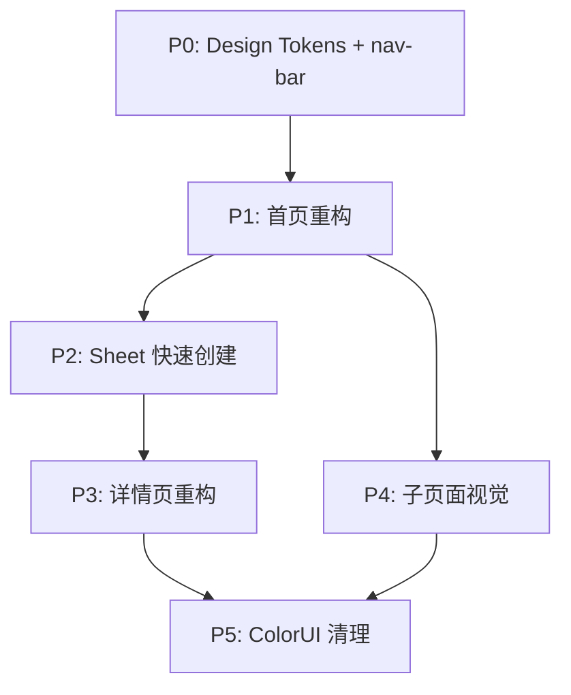

# UI 全站重构 Design

## 需求简述

基于 Apple HIG 设计语言对 Toolbox 全部 9 个页面进行视觉和交互重构。核心改动：建立 Design Tokens 体系、毛玻璃导航栏统一、侧边栏替代抽屉、Sheet 快速创建、详情页 AI 笔记内联展示、标签色板迁移。

**涉及模块**：
- 新建组件：nav-bar、sidebar、create-sheet
- 改造组件：record-card、fab-button
- 工具层：tagColors.js、format.js
- 样式层：新建 tokens.scss
- 全部 9 个页面文件

**核心约束**：
- 不修改后端云函数和数据库结构
- 不更换技术栈（uni-app Vue 2）
- 不更换 Markdown 编辑器（towxml / md-editor 保持现有）
- 毛玻璃效果需兼容低端安卓机（降级方案）

## 实施分期



## 技术方案

### 模块一：Design Tokens（P0）

#### 1.1 新建 styles/tokens.scss

全站设计变量集中管理，按类别分组：

```scss
// 颜色
$color-primary: #007AFF;
$color-primary-light: rgba(0,122,255,0.10);
$color-success: #34C759;
$color-warning: #FF9500;
$color-error: #FF3B30;
$color-text-primary: #1C1C1E;
$color-text-secondary: #3C3C43;
$color-text-tertiary: #8E8E93;
$color-bg-page: #F2F2F7;
$color-bg-card: #FFFFFF;

// 圆角
$radius-card: 16px;
$radius-button: 12px;
$radius-tag: 6px;
$radius-pill: 20px;

// 间距（8pt 网格）
$spacing-xs: 4px;
$spacing-sm: 8px;
$spacing-md: 16px;
$spacing-lg: 24px;
$spacing-xl: 32px;

// 阴影
$shadow-card: 0 1px 4px rgba(0,0,0,0.03);
$shadow-sidebar: 6px 0 40px rgba(0,0,0,0.12);
$shadow-fab: 0 4px 16px rgba(0,122,255,0.35);

// 动画
$duration-fast: 150ms;
$duration-normal: 250ms;
$duration-slow: 350ms;
$ease-out: cubic-bezier(0.25, 0.46, 0.45, 0.94);

// 毛玻璃 mixin
@mixin glass-bg($opacity: 0.72) {
  background: rgba(255, 255, 255, $opacity);
  /* #ifndef APP-PLUS-NVUE */
  backdrop-filter: blur(24px);
  -webkit-backdrop-filter: blur(24px);
  /* #endif */
}
```

#### 1.2 引入方式

在 `uni.scss` 中 `@import './styles/tokens.scss'`，所有页面和组件可直接使用变量。

### 模块二：导航栏组件（P0）

#### 2.1 新建 component/nav-bar/index.vue

**Props**：

| Prop | 类型 | 默认值 | 说明 |
|------|------|--------|------|
| title | String | '' | 页面标题 |
| showBack | Boolean | false | 是否显示返回按钮 |
| showMenu | Boolean | false | 首页专用，显示菜单按钮 |

**Events**：`@menu-click`、`@back-click`

**关键实现**：
- `statusBarHeight`：通过 `uni.getSystemInfoSync().statusBarHeight` 获取
- `handleBack`：`uni.navigateBack({ delta: 1 })`
- 安卓降级：通过平台判断动态添加 `.nav-bar--android` class

#### 2.2 替换策略

逐页替换 `cu-custom`：

| 页面 | 现有 | 替换为 |
|------|------|--------|
| home/index.vue | `<cu-custom bgColor="bg-gradual-blue">` | `<nav-bar showMenu @menu-click="openSidebar">` |
| depart/form.vue | `<cu-custom bgColor="bg-gradual-blue">` | `<nav-bar title="编辑记录" showBack>` |
| depart/detail.vue | `<cu-custom bgColor="bg-gradual-blue">` | `<nav-bar title="记录详情" showBack>` |
| depart/learn-result.vue | `<cu-custom bgColor="bg-gradual-orange">` | `<nav-bar title="学习结果" showBack>` |
| summarize/index.vue | `<cu-custom bgColor="bg-gradual-blue">` | `<nav-bar title="编辑内容" showBack>` |
| dictCategory/index.vue | `<cu-custom bgColor="bg-gradual-pink">` | `<nav-bar title="标签管理" showBack>` |
| changelog/index.vue | `<cu-custom bgColor="bg-gradual-blue">` | `<nav-bar title="更新日志" showBack>` |

### 模块三：侧边栏组件（P1）

#### 3.1 新建 component/sidebar/index.vue

**Props**：

| Prop | 类型 | 默认值 | 说明 |
|------|------|--------|------|
| visible | Boolean | false | 控制显示/隐藏 |
| tagList | Array | [] | 标签列表 |
| recordCount | Number | 0 | 记录总数 |
| isGuest | Boolean | true | 是否游客 |

**Events**：

| Event | Payload | 说明 |
|-------|---------|------|
| @close | - | 关闭侧边栏 |
| @tag-select | tagId: string | 选择标签（空字符串=全部） |
| @quick-action | action: string | 快捷操作（ocr/link/ai-history） |
| @navigate | url: string | 导航跳转 |

**状态管理**：

侧边栏不使用 Vuex，由首页通过 props/events 管理状态：

```js
// pages/home/index.vue
data() {
  return {
    sidebarVisible: false,
    selectedTagId: ''
  }
},
methods: {
  openSidebar() { this.sidebarVisible = true },
  closeSidebar() { this.sidebarVisible = false },
  handleTagSelect(tagId) {
    this.selectedTagId = tagId
    this.filterRecordsByTag(tagId)
    this.closeSidebar()
  }
}
```

**动画实现**：
```scss
.sidebar {
  transform: translateX(-100%);
  transition: transform $duration-normal $ease-out;

  &--visible {
    transform: translateX(0);
  }
}
```

### 模块四：Sheet 快速创建组件（P2）— 两阶段流程

#### 4.1 新建 component/create-sheet/index.vue

**两阶段设计**：

- **Phase 1（`!contentReady`）**：仅显示三个输入方式卡片（手动输入 / 拍照识别 / 导入链接），点击即 emit `method-select`
- **Phase 2（`contentReady`）**：编辑器返回后自动进入，显示标题输入 + 标签选择 + 总结状态/预览 + 保存按钮

**Props**：

| Prop | 类型 | 默认值 | 说明 |
|------|------|--------|------|
| visible | Boolean | false | 控制显示/隐藏 |
| tagMap | Object | {} | 标签映射 |
| summarizeId | String | '' | 编辑器保存后的总结 ID，有值时进入 Phase 2 |
| summaryPreview | String | '' | 总结内容预览文字（前 60 字） |

**Events**：

| Event | Payload | 说明 |
|-------|---------|------|
| @close | - | 关闭 Sheet |
| @method-select | method: string | Phase 1 选择输入方式（manual/ocr/link/reedit） |
| @submit | { title, tags } | Phase 2 保存记录 |

**表单状态**：

```js
data() {
  return {
    title: '',
    selectedTags: [],      // 已选标签 ID 数组
    domVisible: false,     // DOM 是否存在（动画控制）
    showSheet: false       // CSS 动画状态
  }
}
```

**校验逻辑**：
```js
computed: {
  contentReady() { return !!this.summarizeId },
  canSubmit() {
    return this.title.trim() !== ''
      && this.selectedTags.length > 0
      && this.contentReady
  }
}
```

**完整创建流程（home/index.vue 协调）**：

```
FAB → Sheet Phase 1（三选一）
  │ emit method-select → home.handleMethodSelect(method)
  │ Sheet 不关闭（页面栈保留 DOM 状态）
  ▼
┌─ manual → navigateTo summarize/index.vue?id=
│  OCR    → processOcr(store) → navigateTo summarize
│  link   → processLinkImport(store) → navigateTo summarize
│
│  编辑器保存 → Vuex cacheSummary → navigateBack
│
│  home.onShow → sheetCreationMode=true → 读 Vuex.summarizeId
│  → pendingSummarizeId=sid → fetchSummaryPreview(sid)
│  → Sheet 自动进入 Phase 2（summarizeId prop 变化触发 contentReady）
│
│  Sheet Phase 2 → 填标题+标签 → emit submit → home.handleSheetSubmit
│  → addRecord API 直接创建 → 刷新列表
``` |

### 模块五：record-card 改造（P1）

#### 5.1 样式改造

关键改动点：

1. **左侧色条**：通过子 `<view>` 元素实现（伪元素在小程序端兼容性差）
```vue
<view class="card-bar" :style="{ background: barColor }"></view>
```

2. **色条颜色取值**：取记录第一个标签的颜色
```js
computed: {
  barColor() {
    const firstTagId = this.record.tags?.[0]
    const firstTag = this.tagMap[firstTagId]
    const colorIndex = /* 从 tagList 中找到索引 */
    return tagColors[colorIndex % tagColors.length]
  }
}
```

3. **标签样式**：从 ColorUI 类名改为内联样式
```vue
<text
  v-for="(tagId, i) in record.tags"
  :key="tagId"
  :style="{
    background: tagColors[i].bg,
    color: tagColors[i].text
  }"
>{{ tagMap[tagId]?.name }}</text>
```

4. **长按菜单**：替换右上角"···"按钮
```vue
<view @longpress="handleLongPress">
  <!-- 卡片内容 -->
</view>
```

### 模块六：详情页重构（P3）

#### 6.1 操作入口（"..." 菜单 + ActionSheet）

导航栏右侧"..."图标按钮（无背景色），点击弹出 `uni.showActionSheet`，提供编辑/AI辅导/下载/分享/删除操作。替代原设计的 Tip 工具栏，与导航栏菜单按钮合并，消除 UI 冗余。

分享功能独立为弹窗，支持选择链接有效期（1小时/1天/1周/1年/永久）。

#### 6.2 标题区域

`margin-top: $spacing-md` 与导航栏拉开间距，字号 28px 粗体，新增阅读时间估算：

```js
computed: {
  readingTime() {
    const content = this.summaryContent || ''
    const charCount = content.replace(/\s/g, '').length
    const minutes = Math.max(1, Math.ceil(charCount / 300))
    return `${minutes} 分钟阅读`
  }
}
```

#### 6.3 AI 笔记内联卡片

```js
// 数据加载
async loadAiResults() {
  const res = await getLearnResultList({ recordId: this.recordId })
  this.aiResults = res.data || []
  this.noteResults = this.aiResults.filter(r => r.type === 'note' && r.status === 'success')
  this.exerciseResults = this.aiResults.filter(r => r.type === 'exercise' && r.status === 'success')
  this.isAiProcessing = this.aiResults.some(r => r.status === 'pending' || r.status === 'processing')
}
```

**条件渲染**：
```vue
<!-- 有 AI 结果或正在生成时显示 -->
<view v-if="noteResults.length || exerciseResults.length || isAiProcessing" class="ai-card">
  <view v-if="isAiProcessing" class="ai-loading">AI 正在生成中...</view>
  <template v-else>
    <view class="ai-header">✨ AI 学习笔记</view>
    <view v-for="note in noteResults" :key="note._id" class="ai-result-item">
      <view class="ai-result-title">📖 知识点精讲</view>
      <view class="ai-result-preview">{{ getSummary(note.ai_result) }}</view>
      <view class="ai-result-link" @tap="goToAiDetail(note._id)">查看完整笔记 →</view>
    </view>
    <!-- 练习题同理 -->
  </template>
</view>
```

### 模块七：工具层改造（P5）

#### 7.1 tagColors.js 重构

```js
// 改造后：独立色值对象
export const tagColors = [
  { bg: 'rgba(0,122,255,0.10)',  text: '#007AFF', bar: '#007AFF' },  // 蓝
  { bg: 'rgba(175,82,222,0.10)', text: '#AF52DE', bar: '#AF52DE' },  // 紫
  { bg: 'rgba(255,149,0,0.10)',  text: '#FF9500', bar: '#FF9500' },  // 橙
  { bg: 'rgba(52,199,89,0.10)',  text: '#34C759', bar: '#34C759' },  // 绿
  { bg: 'rgba(255,59,48,0.10)',  text: '#FF3B30', bar: '#FF3B30' },  // 红
  { bg: 'rgba(90,200,250,0.10)', text: '#5AC8FA', bar: '#5AC8FA' },  // 青
  { bg: 'rgba(255,45,85,0.10)',  text: '#FF2D55', bar: '#FF2D55' },  // 粉
  { bg: 'rgba(88,86,214,0.10)',  text: '#5856D6', bar: '#5856D6' },  // 靛
]

export function getTagColor(index) {
  return tagColors[index % tagColors.length]
}
```

#### 7.2 format.js 增强

```js
/**
 * 智能日期分组：今天/昨天/本周/更早
 */
export function formatSmartDate(dateStr) {
  const date = moment(dateStr)
  const today = moment().startOf('day')
  const diff = today.diff(date.startOf('day'), 'days')

  if (diff === 0) return '今天'
  if (diff === 1) return '昨天'
  if (diff < 7) return '本周'
  return '更早'
}

/**
 * 相对时间格式化
 */
export function formatRelativeTime(dateStr) {
  const date = moment(dateStr)
  const now = moment()
  const diffMinutes = now.diff(date, 'minutes')
  const diffDays = now.startOf('day').diff(date.startOf('day'), 'days')

  if (diffMinutes < 1) return '刚刚'
  if (diffMinutes < 60) return `${diffMinutes}分钟前`
  if (diffDays === 0) return date.format('HH:mm')
  if (diffDays === 1) return `昨天 ${date.format('HH:mm')}`
  if (diffDays < 7) return `${diffDays}天前`
  return date.format('MM-DD')
}
```

**groupRecordsByDate 改造**：

```js
export function groupRecordsByDate(list) {
  const groups = {}
  const order = ['今天', '昨天', '本周', '更早']

  list.forEach(record => {
    const group = formatSmartDate(record.createTime)
    if (!groups[group]) groups[group] = []
    groups[group].push(record)
  })

  return order
    .filter(label => groups[label])
    .map(label => ({ date: label, children: groups[label], count: groups[label].length }))
}
```

## 边界情况

| 场景 | 处理方式 |
|------|---------|
| 毛玻璃效果低端安卓机性能差 | 安卓关闭 backdrop-filter，使用 rgba(255,255,255,0.95) 纯色半透明 |
| 侧边栏滑动与 z-paging 下拉冲突 | 侧边栏仅通过按钮开关，不响应左滑手势 |
| record-card 伪元素色条在小程序端不渲染 | 降级为 view 元素实现色条，通过 :style 绑定颜色 |
| md-editor 组件无法应用外部样式 | 编辑器内部样式单独处理，仅统一外部容器视觉 |
| 全局替换 cu-custom 导致页面高度塌陷 | nav-bar 预留占位高度（statusBarHeight + 44px），与 cu-custom 保持一致 |
| 标签关联记录数需遍历计算导致首屏慢 | 首屏不显示记录数，异步计算后更新 |

## 错误处理

| 错误场景 | 处理方式 |
|---------|---------|
| nav-bar 组件未注册 | 在 main.js 中全局注册或在各页面局部注册 |
| tokens.scss 变量未定义 | 确保 uni.scss 中 @import 路径正确 |
| 侧边栏关闭动画卡顿 | 检查是否有多余的 backdrop-filter 嵌套，安卓端强制降级 |
| Sheet 在低屏设备上显示不全 | 使用 max-height: 75vh + overflow-y: auto |
| 长按菜单与点击事件冲突 | 使用 @touchstart + @touchend + 定时器区分长按和点击 |
| AI 结果加载失败 | 显示"AI 笔记加载失败，点击重试"，不阻塞详情页主内容 |
| 标签色板索引越界 | 使用 index % tagColors.length 取模 |

## 文件变更清单

### 新建文件

| 文件 | 说明 |
|------|------|
| `styles/tokens.scss` | Design Tokens |
| `component/nav-bar/index.vue` | 毛玻璃导航栏 |
| `component/sidebar/index.vue` | 侧边栏 |
| `component/create-sheet/index.vue` | 两阶段快速创建 Sheet |
| `utils/record-create.js` | OCR/链接导入工具函数（home.vue 和 form.vue 共用） |

### 改造文件

| 文件 | 改动范围 |
|------|---------|
| `uni.scss` | 引入 tokens.scss |
| `pages/home/index.vue` | 重构（导航栏+侧边栏+标签筛选+两阶段Sheet+长按菜单+addRecord 直调） |
| `subpackage/depart/form.vue` | 导航栏替换+表单样式+handleOcr/handleLinkImport 改为调用工具函数 |
| `subpackage/depart/detail.vue` | 导航栏+ActionSheet替代Tip工具栏+AI内联+标题margin-top+代码块样式 |
| `subpackage/depart/learn-result.vue` | 视觉更新 |
| `subpackage/depart/learn-result-detail.vue` | 视觉更新 |
| `subpackage/summarize/index.vue` | 视觉更新 |
| `subpackage/dictCategory/index.vue` | 布局+视觉重构+getTagColor 暴露到 methods |
| `subpackage/dictCategory/form.vue` | 视觉更新 |
| `subpackage/changelog/index.vue` | 视觉更新 |
| `component/record-card/index.vue` | 样式改造 |
| `component/fab-button/index.vue` | 样式改造 |
| `component/md-editor/index.vue` | 移除 console.log、未使用 watch，新增 beforeDestroy 清理定时器 |
| `utils/tagColors.js` | 色板重构，移除旧的 tagColorClasses/getTagColorClass |
| `utils/format.js` | 新增 formatRelativeTime/formatSmartDate，修复未来日期和 mutation bug |

## 变更记录

| 日期 | 作者 | 变更内容 |
|------|------|---------|
| 2026-05-13 | yuanchuang | 初始版本 |
| 2026-05-15 | yuanchuang | 实施阶段同步更新：Sheet 改为两阶段、详情页 Tip 工具栏改为 ActionSheet、新增 record-create.js、修复 format.js bug、md-editor 清理 |
