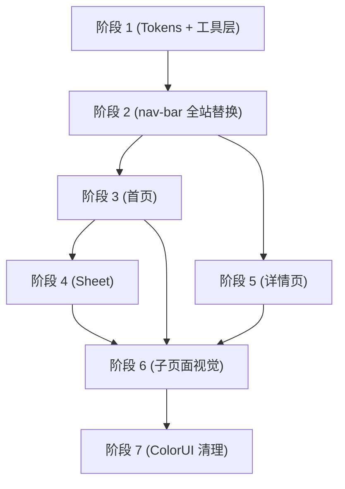

# UI 全站重构 Plan

## 需求简述

基于 Apple HIG 设计语言对 Toolbox 全部 9 个页面进行视觉和交互重构。核心改动：建立 Design Tokens 体系、毛玻璃导航栏统一、侧边栏替代抽屉、两阶段 Sheet 快速创建、详情页 ActionSheet 替代 Tip 工具栏、标签色板迁移。不涉及后端改动。

**涉及范围**：4 个新组件（nav-bar、sidebar、create-sheet）+ 1 个新工具（record-create.js）+ 2 个组件改造（record-card、fab-button）+ 1 个组件清理（md-editor）+ 9 个页面重构 + 2 个工具函数增强。

## 前置条件

- 项目基于 uni-app Vue 2，使用 ColorUI + Vuex + towxml
- 不修改后端云函数和数据库结构
- 毛玻璃效果需兼容低端安卓机（降级方案已设计）
- 现有 `cu-custom` 组件在 7 个页面中使用，需逐页替换
- `utils/format.js` 依赖 moment.js，新函数继续基于 moment 实现
- `uni.scss` 已有部分变量定义，tokens.scss 需与之协调

## 实施阶段

### 阶段 1：Design Tokens + 工具层基础（P0）

**目标**：建立设计变量体系，重构标签色板和时间格式化工具，为后续所有页面改造提供基础。

**为什么先做这个**：所有页面和组件的样式改造都依赖 Tokens 变量和新的工具函数（色板、时间格式），必须最先完成。

- **步骤 1.1**：新建 `styles/tokens.scss`，定义全部 Design Tokens（颜色、圆角、间距、字体、阴影、动画），在 `uni.scss` 中引入
- **步骤 1.2**：重构 `utils/tagColors.js`，从 ColorUI 类名迁移为独立色值对象数组（含 bg/text/bar），新增 `getTagColor(index)` 函数
- **步骤 1.3**：增强 `utils/format.js`，新增 `formatSmartDate(dateStr)` 和 `formatRelativeTime(dateStr)`，改造 `groupRecordsByDate` 使用新的智能分组

**验证点**：
- tokens.scss 编译无报错，变量可在其他 scss 文件中引用
- `getTagColor(0)` 返回 `{ bg: 'rgba(0,122,255,0.10)', text: '#007AFF', bar: '#007AFF' }`
- `formatSmartDate(今天日期)` 返回 `'今天'`
- `formatRelativeTime(1分钟前的日期)` 返回 `'刚刚'`
- `groupRecordsByDate` 返回分组为 `['今天', '昨天', '本周', '更早']`

### 阶段 2：导航栏组件 + 全站替换（P0）

**目标**：新建毛玻璃导航栏组件，替换全站 7 个页面的 cu-custom，统一视觉基调。

**为什么先做这个**：导航栏是每个页面的视觉锚点，统一后其他页面改造才有视觉参照。与阶段 1 可部分并行（组件结构不依赖 Tokens，但样式引用 Tokens）。

- **步骤 2.1**：新建 `component/nav-bar/index.vue`，实现毛玻璃导航栏（Props: title/showBack/showMenu，安卓降级逻辑，statusBarHeight 适配）
- **步骤 2.2**：替换 7 个页面的 cu-custom 为 nav-bar（home、depart/form、depart/detail、depart/learn-result、depart/learn-result-detail、summarize、dictCategory/index、dictCategory/form、changelog）

**验证点**：
- 全站无 `bg-gradual-blue` / `bg-gradual-orange` / `bg-gradual-pink` 导航栏
- 首页左侧菜单按钮显示并可点击
- 子页面返回按钮功能正常（点击返回上一页）
- iOS 毛玻璃效果正常，安卓使用纯色半透明降级
- 各页面标题文字正确显示

### 阶段 3：首页重构（P1）

**目标**：完成首页全部交互改造——侧边栏、标签筛选横滑条、record-card 改造、长按菜单。

**为什么先做这个**：首页是用户入口，改动量最大且与侧边栏、record-card 紧耦合，需集中完成。

- **步骤 3.1**：新建 `component/sidebar/index.vue`（侧边栏），实现标签筛选、快捷操作、导航链接、游客登录提示
- **步骤 3.2**：改造 `component/record-card/index.vue`（左侧色条 + 独立色值标签 + 长按菜单替换更多按钮 + AI 胶囊角标 + 相对时间）
- **步骤 3.3**：重构 `pages/home/index.vue`——替换导航栏为搜索栏+菜单按钮、删除 drawer-modal 替换为 sidebar、新增标签筛选横滑条、日期分组改造、长按菜单集成、FAB 触发改为打开 Sheet 占位

**验证点**：
- 点击菜单按钮打开侧边栏，点击遮罩关闭
- 侧边栏标签筛选后首页列表正确过滤
- 标签筛选横滑条点击过滤生效
- 日期分组显示"今天/昨天/本周/更早"
- 长按卡片弹出编辑/删除菜单
- 卡片左侧色条颜色与标签色板一致
- AI 胶囊角标正确显示

### 阶段 4：Sheet 快速创建 + 工具层提取（P2）

**目标**：新建两阶段 Sheet 组件，改造 FAB 按钮，提取 OCR/链接导入为工具函数。

**为什么排在这里**：Sheet 触发在首页 FAB 上，依赖阶段 3 完成首页布局改造后才能集成。

- **步骤 4.1**：改造 `component/fab-button/index.vue`（颜色→#007AFF、圆角→16px、阴影→蓝色调）
- **步骤 4.2**：新建 `component/create-sheet/index.vue`（两阶段：Phase 1 三选一输入方式 → Phase 2 标题+标签+总结预览+保存）
- **步骤 4.3**：新建 `utils/record-create.js`（提取 `processOcr` 和 `processLinkImport` 工具函数）
- **步骤 4.4**：在 `pages/home/index.vue` 中集成 Sheet（FAB→Sheet Phase1→编辑器→onShow 检测→Sheet Phase2→addRecord 直调）
- **步骤 4.5**：改造 `subpackage/depart/form.vue`（handleOcr/handleLinkImport 改为调用工具函数）

**验证点**：
- FAB 颜色为 #007AFF，圆角方形
- FAB 点击弹出 Sheet Phase 1（三选一输入方式）
- 选择方式后跳转编辑器，Sheet 不关闭
- 编辑器保存返回后，Sheet 自动进入 Phase 2（总结已完成+预览）
- Phase 2 填写标题+标签后可保存，记录创建成功
- Sheet 关闭动画流畅
- form.vue 的 OCR/链接导入功能不受影响

### 阶段 5：详情页重构（P3）

**目标**：详情页新增 ActionSheet 操作入口、AI 笔记内联展示、代码块样式、阅读时间估算。

**为什么排在这里**：与首页独立，但依赖阶段 2 的导航栏替换完成。可与阶段 4 并行。

- **步骤 5.1**：新增 Tip 工具栏（编辑/AI辅导/下载/分享/删除 水平滚动胶囊），移除原有独立按钮和底部工具栏
- **步骤 5.2**：新增 AI 笔记内联卡片区域（调用 getLearnResultList，按 type 分组展示 note/exercise 摘要，点击跳转详情）
- **步骤 5.3**：新增阅读时间估算（computed: content.length / 300）、标题样式放大、标签独立色值
- **步骤 5.4**：Markdown 代码块样式覆盖（深色背景 + 浅色文字 + 行内代码红色）

**验证点**：
- Tip 工具栏 5 个按钮均可点击且功能正常
- AI 笔记有结果时显示卡片（精讲+练习），无结果时不显示
- AI 正在生成时显示"AI 正在生成中..."
- 点击"查看完整笔记/练习"跳转 learn-result-detail
- 阅读时间估算显示"X 分钟阅读"
- 代码块深色背景 + 浅色文字

### 阶段 6：子页面视觉统一（P4）

**目标**：剩余 6 个子页面的视觉统一（导航栏已由阶段 2 完成，本轮处理其余样式）。

**为什么排在这里**：独立页面，改动模式统一（样式替换），依赖阶段 1 的 Tokens 和阶段 2 的导航栏。

- **步骤 6.1**：`subpackage/depart/form.vue` — 表单卡片圆角 16px、标签独立色值胶囊、提交按钮 #007AFF
- **步骤 6.2**：`subpackage/summarize/index.vue` — 编辑区域纯白背景、底部工具栏毛玻璃
- **步骤 6.3**：`subpackage/depart/learn-result.vue` — 背景 #F2F2F7、卡片圆角 16px、徽章圆角 8px、空状态居中文字
- **步骤 6.4**：`subpackage/depart/learn-result-detail.vue` — 背景 #F2F2F7、代码块样式同步
- **步骤 6.5**：`subpackage/dictCategory/index.vue` — 双列网格→单列列表、左侧彩色圆点+记录数+更新时间、公共标签独立区块、FAB 改造
- **步骤 6.6**：`subpackage/dictCategory/form.vue` — 输入框样式同步
- **步骤 6.7**：`subpackage/changelog/index.vue` — 背景 #F2F2F7、卡片圆角 16px、QQ 群区域圆角统一

**验证点**：
- 各页面视觉与 Design Tokens 一致
- 所有页面功能不受影响
- 标签管理页单列列表布局正常
- 公共标签独立区块显示

### 阶段 7：ColorUI 依赖清理（P5）

**目标**：移除 ColorUI 中已无用的样式引用，确保全站无残留。

**为什么最后做**：清理需等所有页面改造完成，确保没有遗漏的依赖。

- **步骤 7.1**：全局搜索 `cu-custom`、`bg-gradual-*`、`shadow-warp`、`tagColorClasses` 引用，逐一替换或删除
- **步骤 7.2**：检查 `colorui/` 目录中仍被使用的组件（如 cuIcon 图标），确认最小依赖集
- **步骤 7.3**：最终视觉回归检查——全站无 ColorUI 渐变、间距符合 8pt 网格、圆角统一、颜色全部引用 Tokens

**验证点**：
- 全站无 `bg-gradual-blue` / `bg-gradual-orange` / `bg-gradual-pink`
- 全站无 `shadow-warp` 引用
- 无残留 `tagColorClasses` 引用
- 间距符合 8pt 网格（8/16/24/32）
- 圆角统一：卡片 16px、按钮 12px、标签 6px、胶囊 20px

## 并行策略

- 阶段 3（首页）和阶段 5（详情页）改动互不影响，可并行开发
- 阶段 4 依赖阶段 3（Sheet 在首页 FAB 触发）
- 阶段 6 可在阶段 3-5 进行时同步启动（页面间无依赖）
- 阶段 7 必须最后执行

## 风险与应对

| 风险 | 影响阶段 | 应对方案 |
|------|---------|---------|
| 毛玻璃效果低端安卓机卡顿 | 阶段 2 | 安卓平台关闭 backdrop-filter，使用 `rgba(255,255,255,0.95)` 纯色半透明替代 |
| 侧边栏与 z-paging 下拉手势冲突 | 阶段 3 | 侧边栏仅通过按钮开关，不响应左滑手势 |
| record-card 伪元素色条在小程序端不渲染 | 阶段 3 | 降级为 `<view>` 元素实现色条，通过 `:style` 绑定颜色 |
| md-editor 组件无法应用外部样式 | 阶段 6 | 编辑器内部样式单独处理，仅统一外部容器视觉 |
| 全局替换 cu-custom 导致页面高度塌陷 | 阶段 2 | nav-bar 预留占位高度（statusBarHeight + 44px），与 cu-custom 保持一致 |

## 变更记录

| 日期 | 作者 | 变更内容 |
|------|------|---------|
| 2026-05-13 | yuanchuang | 初始版本 |
| 2026-05-15 | yuanchuang | 实施阶段同步更新：Sheet 改为两阶段、详情页 Tip 工具栏改为 ActionSheet、新增 record-create.js、修复 format.js bug |
